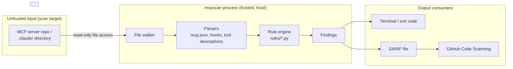

# Threat Model — mcpscan

STRIDE-based threat model for `mcpscan`, a static analysis scanner for MCP servers and Claude Code project directories. This document covers the scanner itself as an artifact running in a user's or CI's trust boundary — not the MCP servers it scans, which are the *subject* of analysis, not part of this system.

## 1. System Overview

`mcpscan` is a Python CLI, zero runtime dependencies, zero network calls. It walks a target directory (an MCP server repo or a `.claude/` project directory), parses config/manifest files (`mcp.json`, hook configs, tool descriptions, SDK lockfiles), runs a fixed set of static rules (`mcpscan/rules/*.py`) against the parsed data, and emits findings as text, JSON, or SARIF 2.1.0.

## 2. Trust Boundaries & Data Flow

| Boundary | Description |
|---|---|
| **B1 — Scan target ↔ mcpscan process** | The scan target is attacker-controlled by definition (that's what's being vetted). mcpscan only ever *reads* it — no execution, no `eval`, no dynamic import of scanned code. |
| **B2 — mcpscan ↔ host filesystem** | mcpscan needs read access to the target tree. It should not need write access outside its own output file. |
| **B3 — mcpscan ↔ network** | None. Zero network calls is a design invariant, not just a badge — it removes an entire class of exfiltration and MITM risk during a security-review step. |
| **B4 — SARIF output ↔ downstream consumers** | GitHub Code Scanning, CI gates, and human reviewers trust the SARIF file's contents as fact. A false negative here is worse than mcpscan simply not existing (false confidence). |

Data flow is one-directional: scan target → parsed structures → rule engine → findings → output. No feedback loop, no persistence beyond the emitted report.

## 3. STRIDE Threat Matrix

| Category | Threat | Applies? | Notes |
|---|---|---|---|
| **Spoofing** | A malicious MCP server spoofs a trusted publisher's metadata to lower scrutiny | Indirect | Out of scope for the scanner itself; mcpscan doesn't verify publisher identity, only content. Recommend supply-chain provenance checks (e.g. sigstore) as a complementary control, not a mcpscan responsibility. |
| **Tampering** | Crafted input (e.g. a malformed `mcp.json` or a tool description engineered to break a parser) causes a parser crash or, worse, silent misparse that suppresses a real finding | **Yes — primary threat** | Parsers must fail closed (crash/error the scan) rather than fail open (silently skip and report clean). |
| **Repudiation** | A CI run reports "clean" but the scan never actually executed a rule (e.g. rule import failure swallowed by a broad `except`) | **Yes** | Rule execution failures must surface as scan failures, not silent passes, or the SARIF output becomes an unfalsifiable claim. |
| **Information Disclosure** | mcpscan's own output (SARIF/JSON) echoes back secrets it found (e.g. an API key detected by the `secrets` rule) into a CI log or a public SARIF artifact | **Yes** | Secret-detection findings should reference location, not reproduce the full matched secret verbatim in output. |
| **Denial of Service** | A target repo with adversarially large or deeply nested config files (e.g. a `mcp.json` with megabytes of tool descriptions, or symlink loops in the target tree) causes mcpscan to hang or OOM in CI | **Yes** | Zero-dependency parsing must still bound recursion depth and file-size reads; CI timeouts are a backstop, not a substitute. |
| **Elevation of Privilege** | mcpscan is invoked with elevated permissions (e.g. as a pre-commit hook running as a privileged CI service account) against an untrusted target, and a parser bug is used to escape read-only analysis into code execution | **Yes — highest severity if present** | mcpscan must never `eval`, `exec`, `import`, or otherwise execute code found in the scan target. Static parsing only. This is the invariant the whole tool's threat model rests on. |

## 4. Identified Attack Vectors

These are the vectors mcpscan is *built to catch* in the servers it scans (not vectors against mcpscan itself):

- **Tool poisoning** — prompt-injection phrasing embedded in an MCP tool's `description` field, invisible to a human skimming code but read verbatim by the agent (`rules/tool_poisoning.py`).
- **Command injection** — unsanitized shell invocation from tool handlers (`rules/command_injection.py`).
- **Dangerous hooks** — Claude Code hook configs that execute on session events without scoping (`rules/hooks.py`).
- **Risky permissions / over-broad tool annotations** — tools declaring capabilities beyond their stated purpose (`rules/permissions.py`, `rules/tool_annotations.py`).
- **Leaked secrets** — credentials committed alongside MCP server code (`rules/secrets.py`).
- **SSRF / insecure transport / origin-check gaps** — network-facing MCP servers with missing origin validation (`rules/ssrf.py`, `rules/insecure_transport.py`, `rules/origin_check.py`).
- **Vulnerable SDKs** — known-bad version ranges of MCP SDK dependencies (`rules/sdk_versions.py`).

## 5. Security Controls & Mitigations Implemented

| Control | Implementation |
|---|---|
| No code execution on untrusted input | Static file/AST parsing only; no `eval`/`exec`/dynamic import of scan-target code |
| No network exfiltration surface | Zero runtime dependencies, zero network calls — verified by the absence of any HTTP client in the dependency tree |
| Fail-closed on parse errors | Parser exceptions propagate to a non-zero exit code rather than being swallowed |
| CI-native output | SARIF 2.1.0 output integrates directly with GitHub Code Scanning, so findings are gated the same way first-party CodeQL findings are |
| Self-scanning in CI | mcpscan's own CI pipeline runs `mcpscan .` against its own source and `mcpscan tests/fixtures/clean` against a known-clean fixture — dogfooding as a regression test for both false positives and false negatives |
| Minimum severity gating | `--min-severity` flag lets CI fail builds only above a chosen bar, avoiding alert fatigue that leads to findings being ignored |

## 6. Residual Risk / Not Covered

- mcpscan does not execute or sandbox-run the MCP server it scans — it cannot catch runtime-only behavior (e.g. a tool that behaves correctly until a specific environment variable is set). Static analysis has an inherent recall ceiling; this tool is a first gate, not a complete guarantee.
- Publisher/provenance verification (is this MCP server actually from who it claims to be) is out of scope — see Spoofing note above.
